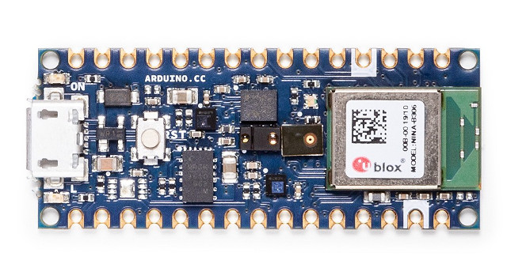

# Exercise 2: Connecting the board

## Unboxing and set up

1. Remove the Arduino Nano 33 BLE Sense board from the box
1. Plug the micro USB cable into the board and your computer
1. Open the Arduino IDE application on your computer
1. Choose the board `Tools -> Board -> Arduino Nano 33 BLE`
1. Choose the port `Tools -> Port -> COM5 (Arduino Nano 33 BLE)` Note that the actual port may be different on your computer

## LSM9DS1 Examples (Optional)

You can try the example sketches that came with the LSM9DS1 library.

1. Open the Simple Accelerometer sketch using `File -> Examples -> Arduino_LSM9DS1 -> SimpleAccelerometer`
1. Upload the sketch to the board using the `Sketch -> Upload` menu or the right arrow button from the tool bar.
1. Open the Serial Monitor `Tools -> Serial Monitor` to view the text output
1. Open the Serial Plotter `Tools -> Serial Plotter` to view the output on a graph

Next [Exercise 3: Visualize the IMU Data](exercise3.md)
