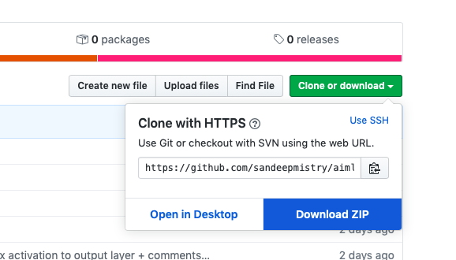
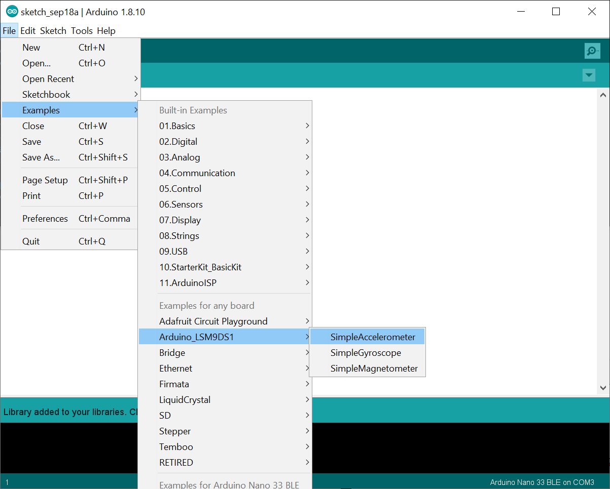
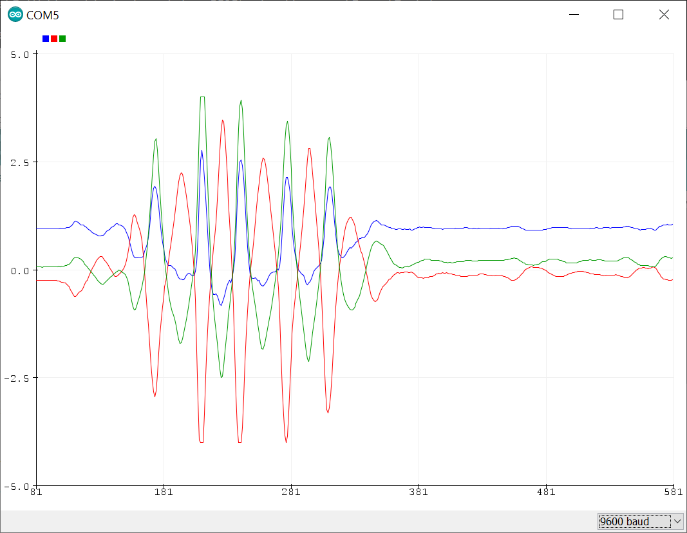

# Exercise 2: Assemble the Hardware

1. Remove the Arduino Nano 33 BLE Sense board from the box
1. Hold the Arduino with the USB connector toward the left
1. Plug the Arduino into the bottom of the mini solderless breadboard
1. You should see 4 rows of holes above the Arduino board
1. Take the button and gently insert it into the breadboard
1. The right side of the button should be in the ground pin, which is denoted by a white mark
1. The left side of the button should be in pin D3. (The pin labels are on the bottom of the board, so match your setup with the picture below.)

## Get the Code

Clone or download this [git repository](https://github.com/sandeepmistry/aimldevfest-workshop-2019/). If you're familiar with [git](https://git-scm.com), clone this repository, otherwise, click the [green button]((https://github.com/sandeepmistry/aimldevfest-workshop-2019/) to download a zip file with all the code.

## Hardware Test

1. Plug the micro USB cable into the board and your computer
1. Open ArduinoSketches/HardwareTest/HardwareTest.ino in the Arduino IDE
1. Choose the board `Tools -> Board -> Arduino Nano 33 BLE`
1. Choose the port `Tools -> Port -> COM5 (Arduino Nano 33 BLE)` Note that the actual port may be different on your computer
1. Upload the code to the board `Sketch -> Upload`
1. Press the button and the on-board LED will light up
1. Release the button and the on-board LED will shut off
1. Open the serial monitor `Tools -> Serial Monitor` to see debug messages

## LSM9DS1 Examples (Optional)

You can try the example sketches that came with the LSM9DS1 library.

1. Open the Simple Accelerometer sketch using `File -> Examples -> Arduino_LSM9DS1 -> SimpleAccelerometer`
1. Upload the sketch to the board using the `Sketch -> Upload` menu or the right arrow button from the tool bar.
1. Open the Serial Monitor `Tools -> Serial Monitor` to view the text output
1. Open the Serial Plotter `Tools -> Serial Plotter` to view the output on a graph

Next [Exercise 3: Visualize the IMU Data](exercise3.md)
